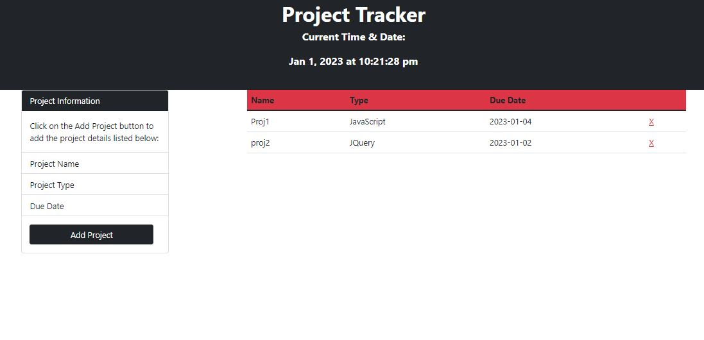

# Project-Tracker
This repository contains Third Party APIs project to create a project tracker application using Bootstrap, Google Fonts, jQuery and Day.js

## Description

This application allows the user tokeep track and manage their projects.  The application has following fetures:

1. A header/hero area that welcomes users to the application and displays the current time and date using Day.js. The current time and date is updated every second with `setInterval()`. The data is formatted with the abbreviated month, day, full year, and time (e.g. `Jun 30, 2022 at 08:37:48 am`).

2. A Bootstrap card component is on left side explaining the instructions of how to use the app and a button to open a [Bootstrap modal dialog](https://getbootstrap.com/docs/5.1/components/modal/).

3. The modal contains a form asking users to fill in the following data:

    * The name of the project.

    * The type of project. 

    * The date the project is due.

4. A Bootstrap table on right displays the project's information with columns for the following data:

    * Project name

    * Project type

    * Due date

5. Each submit in modal dialog, use that data to create a new table row on the page.

6. On submission, the input values from the form are stored in the localStorage so that the projects that have been added are persistent. 

7. The form data is cleared so that the user can easily add additional projects.

8. The modal closes when the user submits the form.

9. The saved projects from localStorage are read on start of the application.

10. If the project is past due, the row for the project will have a light red background. If the project is due today, the row will have a light yellow background.

11. A button for deleting a project from the list is present in an unnamed column which will remove the row from the page and the project from removed from localStorage. 

## Mock Up

Demo of the project:

## Usage
You can access:
1. the file in GitHub repository: https://github.com/rbhumbla1/Project-Tracker
2. the application using this URL: https://rbhumbla1.github.io/Project-Tracker

## License
None